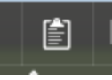
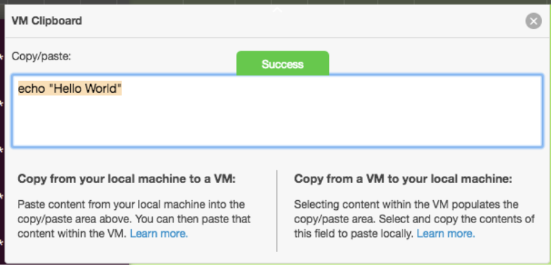

# Learn Kubernetes Basics with IBM Cloud Private

The labs in this repository are created to help learn basics of Kubernetes with
IBM Cloud Private (ICP). We have tested these labs using ICP but the content is
generic enough to use on any cloud platform or local Kubernetes environment
like Minikube.

## How to connect to the Skytap VMs

Use the following credential to access the environment:

```
user:ibmuser

pwd: thinkibm
```


## How to copy and paste commands to your environment

During this lab, you will copy and paste extensively commands from this document to your Skytap environment.

Follow these steps to copy and paste a command to your environment:

* Select the command you want to execute (with ^C)
* At the very top of your Skytap window, you will find the following icon. Click on it.



You will see the following dialog:



Paste your command (with ^V)

The dialog should disappear (if not, do it again)


## Set up connection to Kubernetes environment
Set up the connection to the Kubernetes environment following the instruction provided [here].

[here]: ./SetupICPEnv/setupenv.md

## Clone this repository

After setting up the connection to the Kubernetes environment, execute the following command in a Terminal window to clone this repository

```
git clone https://github.com/spzala/icpk8s.git
cd icpk8s/Labs
```

## Labs

* [Lab1](Labs/Lab1/README.md)
* [Lab2](Labs/Lab2/README.md)
* [Lab3](Labs/Lab3/README.md)
* [Lab4](Labs/Lab4/README.md)
* [Lab5](Labs/Lab5/README.md)
* [Lab6](Labs/Lab6/README.md)
* [Lab7](Labs/Lab7/README.md)
* [Lab8](Labs/Lab8/README.md)
* [Lab9](Labs/Lab9/README.md)
* [Lab10](Labs/Lab10/README.md)
